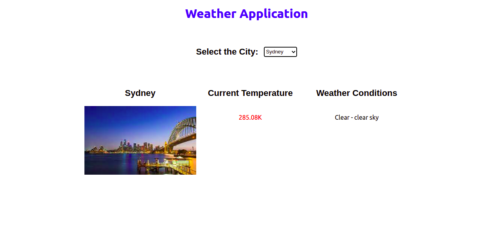
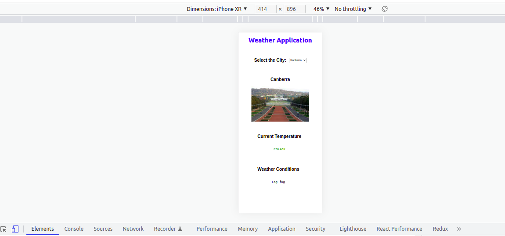

# Weather-App

# Execute following Node commands to Setup the application:

a) Clone the repository

git clone https://github.com/Uwaisul-Karnain-Git/React-Responsive-Weather-App---TypeScript-React-V18.1.0.git

b) Install the necessary packages and run the React app:

Generate 'node_modules'
npm install

Run React app
npm start

c) On a new terminal window, install and run the json server:

To install the json server:
npx i json-server

To run the json server (on port 3500):
npx json-server -p 3500 -w data/capitalCitiesData.json

json-server url: 
http://localhost:3500/cities

# How the app works and its features:

After loading the application, you have to select a city from the dropdown.
Current weather information of that selected city will be populated below as the attached screen shots.

- While weather information will be populated horizontally on larger screens, they will be displayed vertically on mobile devices.
- If the temperature is greater than 283.15K, it'll be displayed in 'Red' font and other wise font will be green.

# Screenshots of the final outcome:

Desktop Screen

Mobile Screen

# References:
1. https://openweathermap.org/current
2. https://openweathermap.org/api/geocoding-api
3. https://en.wikipedia.org/wiki/List_of_Australian_capital_cities

